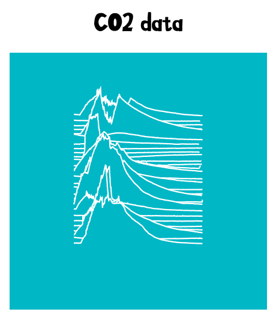
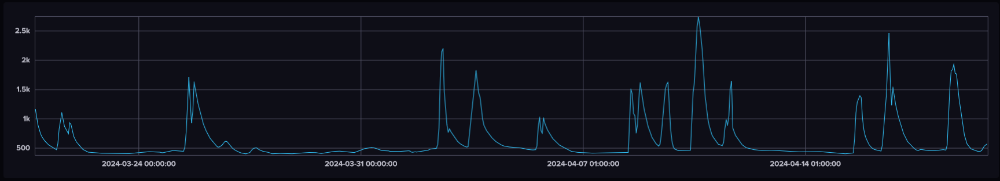
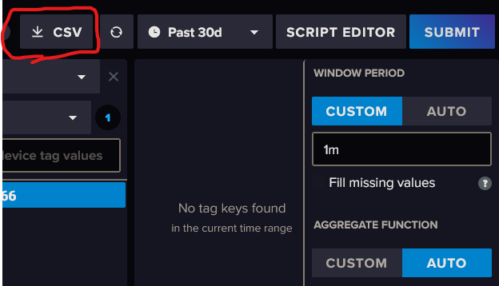

# CO2 Stacked

A visualisation of CO2 levels as a vertically stacked graph, with days going upwards. Using @tomhazledine's [`<stacked-sparklines>`](https://github.com/tomhazledine/stacked-sparklines) web component.



The original data looked something like this:



## How to create

Export CO2 data as CSV from InfluxDB via the data explorer. It should be several days of data, and the window range can be whatever, but probably change it from auto.



Put this file in this repository, named `query.csv`. Then, run the python script to generate the visualisation.

```bash
python ./csv_to_list-of-lists.py
```

## Note

This was made brashly in a few minutes. Do not expect it to work perfectly ;)
